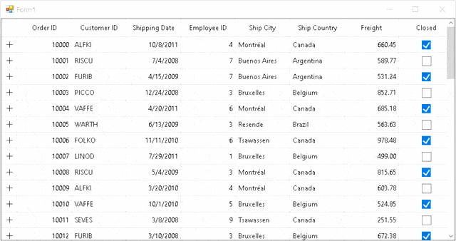

# How to Copy DetailsViewDataGrid Cell or Row in WinForms DataGrid?

This sample illustrates how to copy [DetailsViewDataGrid](https://help.syncfusion.com/cr/windowsforms/Syncfusion.WinForms.DataGrid.DetailsViewDataGrid.html) cell or row in [WinForms DataGrid](https://www.syncfusion.com/winforms-ui-controls/datagrid) (SfDataGrid).

By default, you can copy a cells or rows in `DataGrid` based on the `SelectionUnit`. But in runtime you can change the `SelectionUnit` and copy both cells and rows in `DetailsViewDataGrid` by using context menu click events.

```c#
gridViewDefinition.DataGrid.RecordContextMenu = new ContextMenuStrip();
gridViewDefinition.DataGrid.RecordContextMenu.Items.Add("Copy Cell", null, OnCopyCellClicked);
gridViewDefinition.DataGrid.RecordContextMenu.Items.Add("Copy Row", null, OnCopyRowClicked);

private void OnCopyCellClicked(Object sender, EventArgs e)
{
    var rowindex= this.sfDataGrid1.SelectedDetailsViewGrid.CurrentCell.RowIndex;
    var column = this.sfDataGrid1.SelectedDetailsViewGrid.CurrentCell.ColumnIndex;
    gridViewDefinition.DataGrid.SelectionUnit = Syncfusion.WinForms.DataGrid.Enums.SelectionUnit.Cell;
    sfDataGrid1.SelectedDetailsViewGrid.MoveToCurrentCell(new Syncfusion.WinForms.GridCommon.ScrollAxis.RowColumnIndex(rowindex, column));
    sfDataGrid1.SelectedDetailsViewGrid.ClipboardController.Copy();
}

private void OnCopyRowClicked(Object sender, EventArgs e)
{
    var rowindex = this.sfDataGrid1.SelectedDetailsViewGrid.CurrentCell.RowIndex;
    var column = this.sfDataGrid1.SelectedDetailsViewGrid.CurrentCell.ColumnIndex;
    gridViewDefinition.DataGrid.SelectionUnit = Syncfusion.WinForms.DataGrid.Enums.SelectionUnit.Row;
    sfDataGrid1.SelectedDetailsViewGrid.MoveToCurrentCell(new Syncfusion.WinForms.GridCommon.ScrollAxis.RowColumnIndex(rowindex, column));
    sfDataGrid1.SelectedDetailsViewGrid.ClipboardController.Copy();
}
```



## Requirements to run the demo
 Visual Studio 2015 and above versions